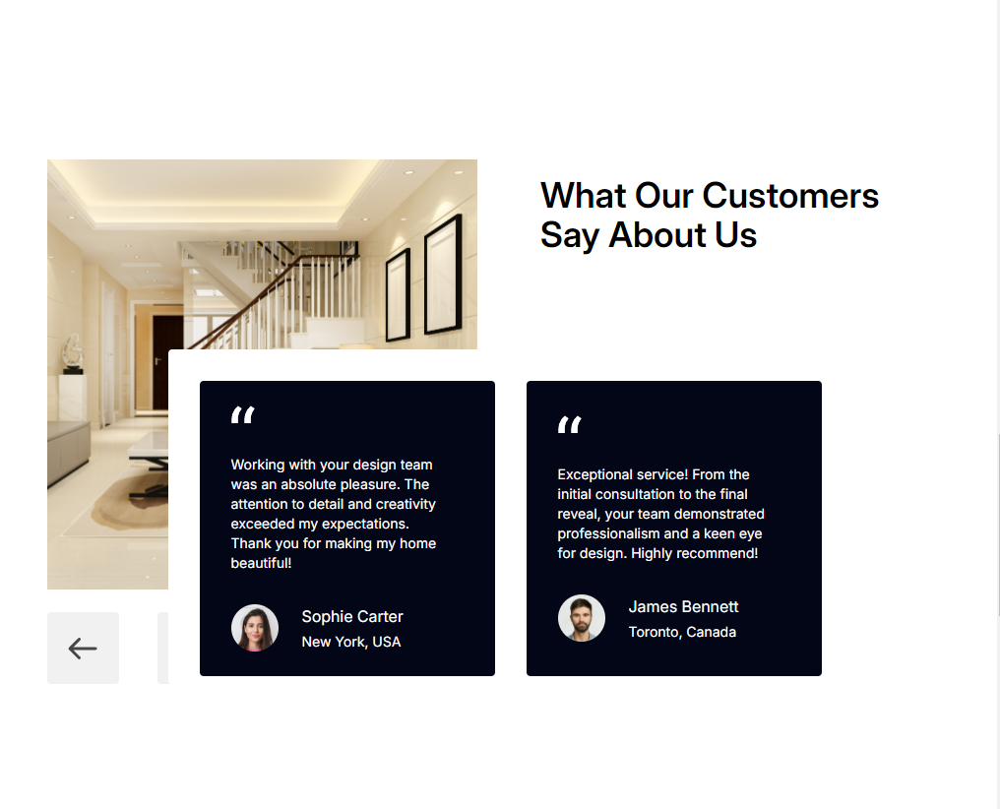
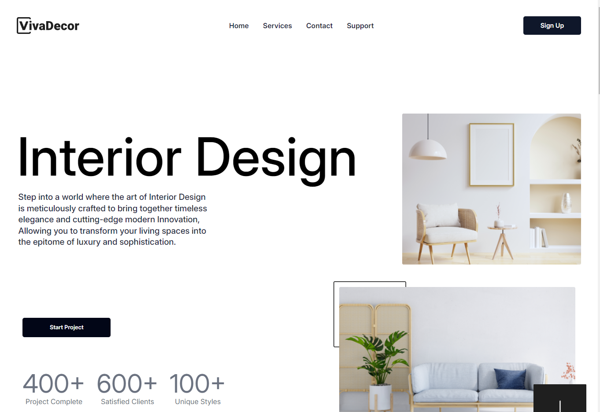

# 🏠 Viva Decor - Interior Design Website

A modern, responsive interior design website built with React and Vite, showcasing luxury interior design services with a sleek user interface.

## ✨ Features

- 🎨 Modern and minimalist design
- 📱 Fully responsive layout for Laptop and Desktop View
- 🔄 Interactive components
- 🎯 Service showcase sections
- 👥 Customer testimonials
- 📧 Newsletter subscription
- 🌓 Smooth animations

## 🛠️ Technologies Used

- **Frontend Framework:** React 18
- **Build Tool:** Vite
  - [@vitejs/plugin-react](https://github.com/vitejs/vite-plugin-react/blob/main/packages/plugin-react/README.md) (Babel)
  - [@vitejs/plugin-react-swc](https://github.com/vitejs/vite-plugin-react-swc) (SWC)
- **Styling:** 
  - Tailwind CSS
  - Custom CSS
- **Font:** Inter (Google Fonts)
- **Code Quality:**
  - ESLint
  - React Hooks Plugin
- **Development Tools:**
  - PostCSS
  - Autoprefixer

## 📸 Screenshots

### Services & Testimonials

*Elegant hero section showcasing interior design services with modern typography and imagery*

### Homepage Hero Section

*Interactive services section with customer testimonials and project statistics*

## 🏗️ Project Structure

The project follows a modular architecture with:

- `components/` - Reusable UI components
- `sections/` - Major page sections
- `assets/` - Images and static resources

## 🚀 Key Components

1. **Header Navigation**
   - Responsive navbar
   - Sign-up button
   - Brand logo

2. **Interactive Elements**
   - Accordion components
   - Service cards
   - Customer testimonial carousel

3. **Newsletter Section**
   - Email subscription form
   - Custom input styling
   - Validation

